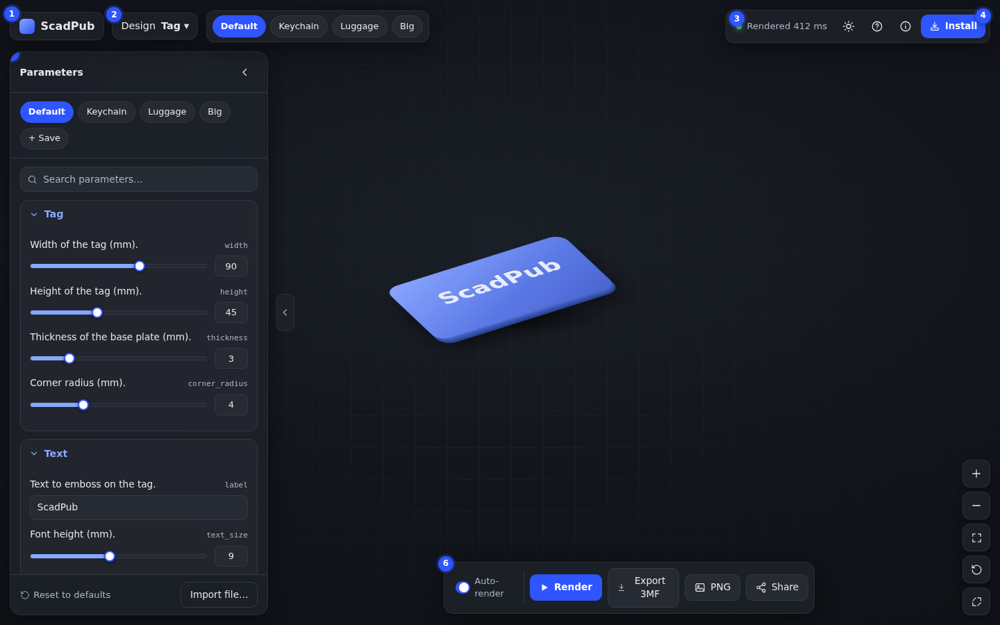
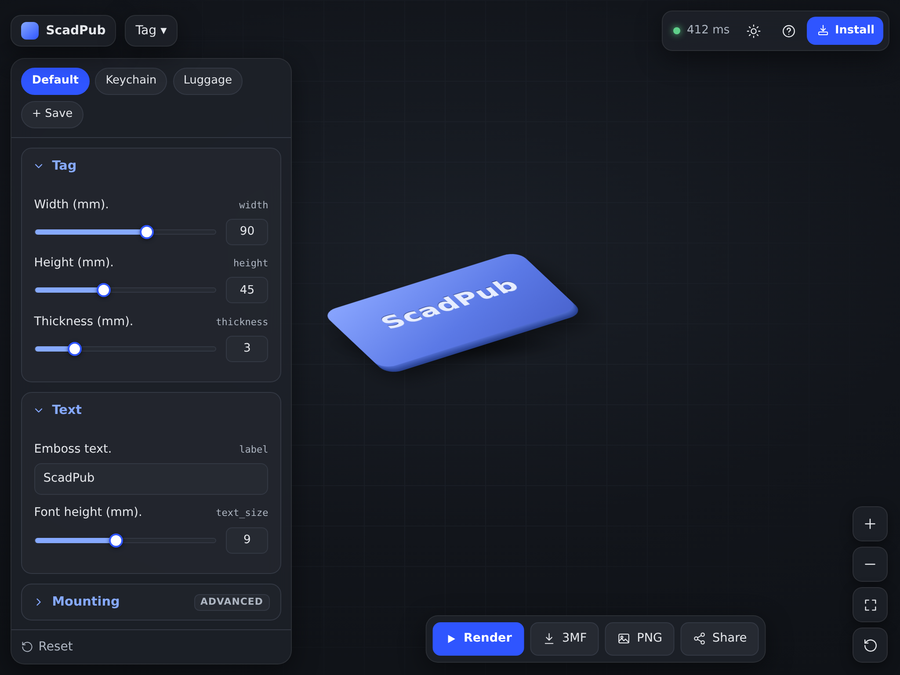
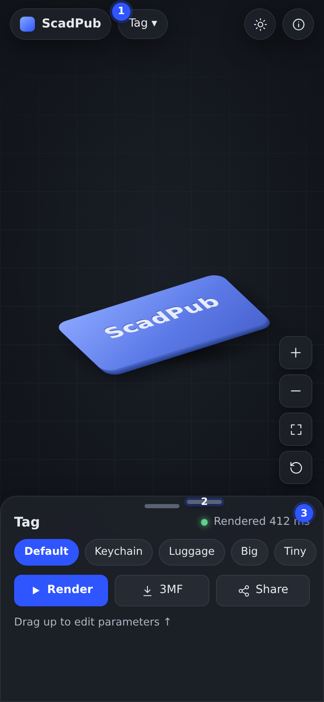
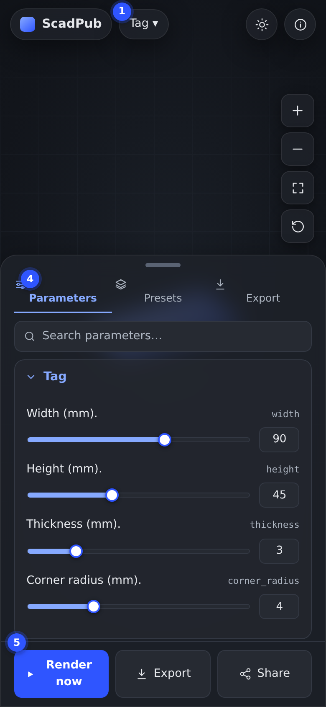
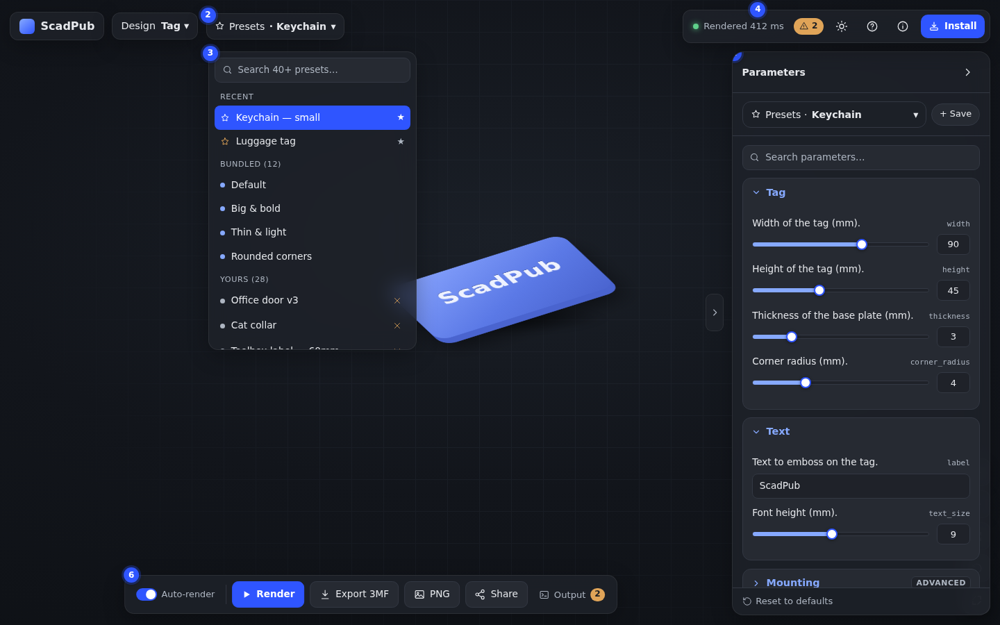
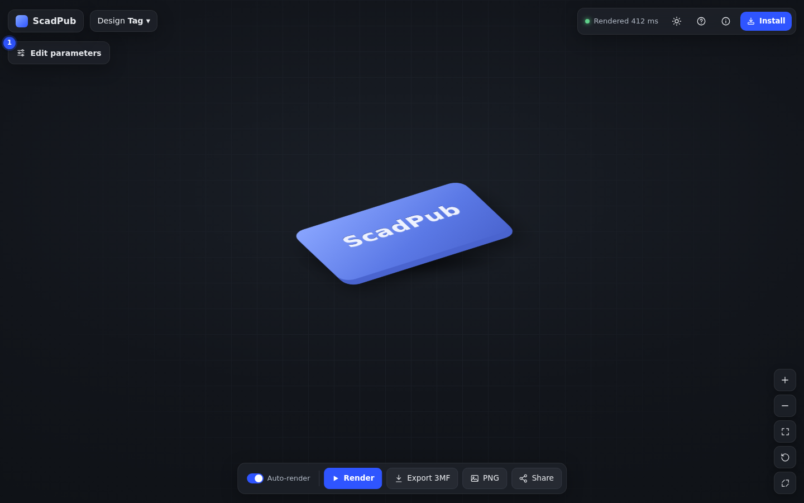
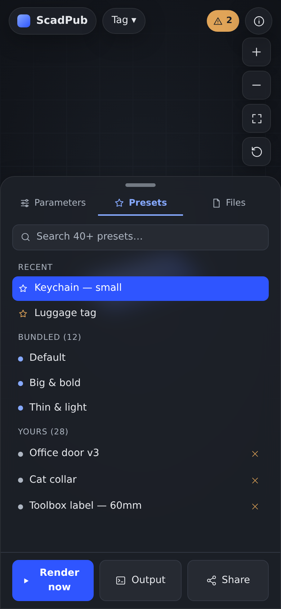
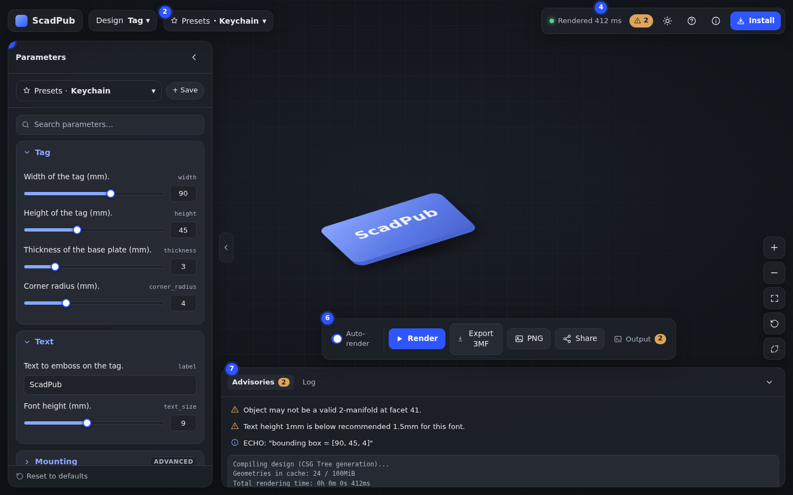
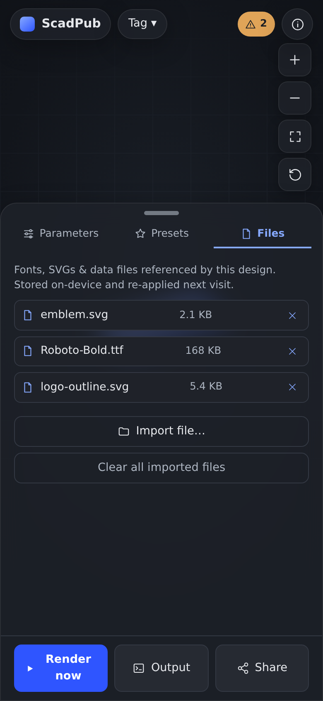
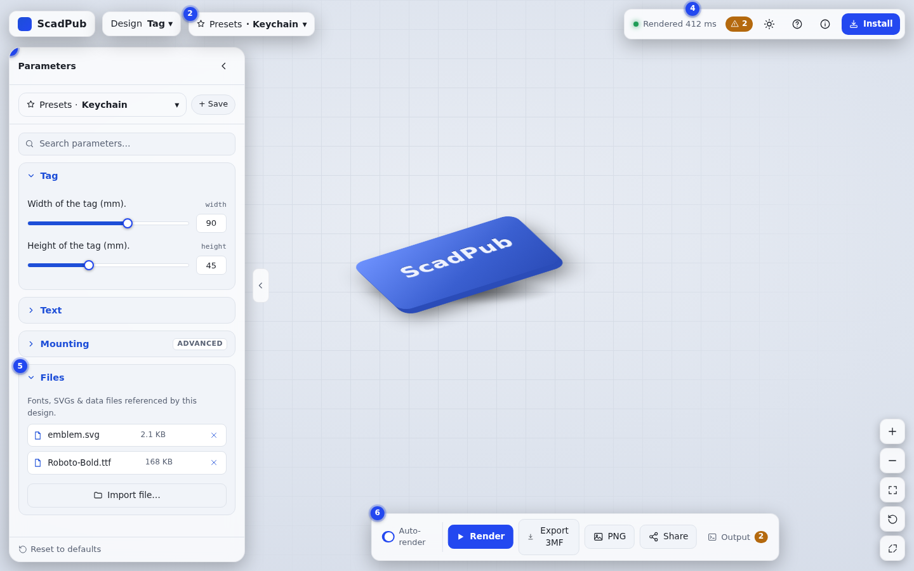

# ScadPub UX & PWA redesign — proposal

> Research + visual proposals for greatly improving the UX from phones to large
> desktops, and making ScadPub feel great as an installed PWA. **No code yet** —
> this is a direction to react to before we build anything.

The mockups in [`mockups/`](./mockups) are generated by
[`build-mockups.mjs`](./build-mockups.mjs) (Playwright). They use ScadPub's real
dark-theme tokens from `src/index.css`, so the look is faithful. The 3D "tag" is
a stand-in for the live three.js render.

---

## 1. What ScadPub is, and where the current UX strains

ScadPub renders OpenSCAD designs client-side (OpenSCAD-WASM) as a static PWA: pick
a design, tweak Customizer parameters, watch a 3D preview, export 3MF/PNG, share a
URL. Today the screen is split: a **fixed 400 px left sidebar** (presets, reset,
parameter form, file import) beside a flexible **preview column** (viewer + action
bar + diagnostics/log). On screens ≤ 820 px the sidebar becomes a left slide-in
drawer and the topbar wraps.

It's solid and accessible, but the layout leaves value on the table:

- **The hero — the 3D model — is boxed in.** On a wide monitor the model gets
  "viewport minus 400 px"; on a phone the drawer covers it entirely while you edit,
  so you lose the see-the-change feedback loop that makes a configurator fun.
- **The fixed-width sidebar doesn't flex.** Can't widen it for a param-heavy
  design, can't collapse it to study the model.
- **The topbar is overloaded** (brand, design picker, preset select, status,
  theme, help, info) and wraps awkwardly on small screens.
- **Actions are scattered** — render/auto-render/export/PNG/share sit in one bar,
  presets + reset live in the sidebar, status lives in the topbar.
- **PWA is "installable" but not "native-feeling"** — no iOS meta tags, no
  safe-area handling, `100vh` clipping, pull-to-refresh can reload mid-drag, no
  rich install UI, SVG-only icons.

---

## 2. The "Google Maps" question — verdict

You were drawn to how Maps looks. The **right** thing to borrow is its _spatial
principle_: **the canvas is the content; controls float or dock lightly around a
maximized canvas, and on mobile a draggable bottom sheet holds the detail.** That
fits a configurator perfectly — Nielsen Norman calls this exact pairing (a
non-modal sheet over a live canvas you keep referencing) the correct use of a
bottom sheet, citing mobile Google Maps.

Two deliberate departures from _literal_ Maps, both backed by recent industry
lessons:

1. **On desktop, don't float the editor over the canvas — dock it.** Figma shipped
   floating panels in 2024 and **reverted to docked panels** because floating
   cramped the canvas and hurt legibility over arbitrary content. Vectary (a 3D
   configurator tool) makes the same split explicit: _floating UI_ for light
   callouts, _docked UI_ for real controls. So: full-bleed canvas + a **docked,
   collapsible, resizable** panel. Float only the search/command bar and the view
   HUD.
2. **On mobile, the sheet is a _persistent editor_, not a dismissible sheet.**
   Maps' sheet is for browsing; ours is the happy path. Keep a always-present
   **peek** detent so it never fully disappears, with Peek / Half / Full snap
   points.

**Net:** adopt the Maps _spirit_ (maximized canvas, floating search + HUD,
draggable mobile sheet), but **dock the editor body** on desktop and make the
mobile sheet a stable, detented editing surface.

---

## 3. The proposed layout system

One parameter-form component, re-flowed into the right container per breakpoint
(so desktop and mobile never drift):

| Tier | Width | Canvas | Editor placement | Search / status | View controls |
|---|---|---|---|---|---|
| **Phone** | < 600 px | Full-bleed; model recenters as sheet moves | **Persistent draggable bottom sheet** — Peek / Half / Full; never fully dismissible | Floating top pill (brand + design + status dot) | Floating HUD, thumb-reach, hides when sheet is Full |
| **Tablet portrait** | 600–905 px | Full-bleed | Bottom sheet, or slim docked rail if content is light | Floating top bar | Floating HUD |
| **Tablet land. / laptop** | 905–1240 px | Full-bleed minus panel | **Docked, collapsible side panel** | Floating top-left + status pill top-right | Floating HUD |
| **Desktop** | 1240–1600 px | Full-bleed minus panel | Docked, **resizable** side panel + "collapse to maximize canvas" | Floating command bar | Floating HUD + bottom action cluster |
| **Large desktop** | > 1600 px | Cap/center model so it isn't lost in whitespace | Side panel (+ optional second inspector) — still docked, never floating | Floating command bar | Floating HUD |

The side-panel ↔ bottom-sheet switch happens around **600–905 px**.

### Desktop — "Studio"


1. **Brand** pill, floating top-left over a full-bleed canvas.
2. **Design picker** as a peer pill (no longer crowding a wrapping topbar).
3. **Live status pill** ("Rendered 412 ms", with a green/blue state dot) anchored
   top-right — render state is always visible without hunting the log.
4. **Install** affordance promoted to the top bar (shown only when installable).
5. **Docked parameter panel** as a floating rounded card: presets as chips +
   "Save", a **parameter search** box (for param-heavy designs), accordion groups
   that map 1:1 to your existing `[Section]` / `@collapsed` headers, advanced
   groups collapsed by default. A **collapse chevron** (and the edge rail) hides
   the panel to study the model full-screen.
6. **Consolidated action cluster**, floating bottom-center: Auto-render toggle ·
   **Render** (primary) · Export 3MF · PNG · Share — one home for every action.
7. **View HUD** bottom-right: zoom in/out, fit-to-view, reset, fullscreen.

### Tablet (landscape)


Same docked-panel model, tightened: narrower rail, condensed status, the action
cluster centered on the canvas. In **portrait** this collapses to the phone bottom
sheet.

### Phone — sheet at Peek


1. **Design picker** in a floating top pill (safe-area aware).
2. **Drag handle** (grabber) — tap cycles Peek → Half → Full; drag to resize.
   Always include a visible control, never handle-only (a11y).
3. **Status** lives on the sheet header.
   The peek shows: title, preset chips (horizontal scroll), and the primary actions
   (Render · 3MF · Share). The model stays fully visible and grab-rotatable above.

### Phone — sheet at Half/Full (editing)


4. **Segmented tabs** inside the sheet (Parameters · Presets · Export) so deep
   flows never **stack** sheets (a top NN/G failure mode).
5. **Sticky footer** keeps Render / Export / Share reachable while scrolling a long
   form. The model recenters upward and stays visible (non-modal, no scrim) so
   edits keep their feedback loop.

---

## 4. PWA: make the installed app feel native

Prioritized; the first group is high-impact / low-cost.

**Must-have**
- `viewport-fit=cover` + `env(safe-area-inset-*)` padding on the top pill and
  bottom sheet/toolbar (notch, home indicator, Dynamic Island). Without
  `viewport-fit=cover` the insets are all `0`.
- Apple PWA meta tags (`mobile-web-app-capable`, `apple-mobile-web-app-*`) — none
  exist today, so iOS gives the app default Safari chrome.
- Real **raster icons**: 192 + 512 + a 512 `maskable`, and a 180×180
  `apple-touch-icon` PNG (the generator currently emits SVG only, which iOS renders
  unreliably). Add to `scripts/gen-schema.mjs`.
- `100dvh` (with `100vh` fallback) for the full-height viewer so the URL bar
  doesn't clip controls.
- `overscroll-behavior: none` on `html, body` to kill pull-to-refresh — critical
  for a drag-to-orbit canvas. `touch-action: none` on the WebGL canvas;
  `touch-action: manipulation` on buttons. Do **not** disable user zoom globally
  (WCAG 1.4.4 — scope gesture handling to the canvas instead).
- Manifest `id`, `description`, `categories`, and **`screenshots`** (narrow + wide)
  so Android shows the rich install dialog. Custom in-app install button via
  `beforeinstallprompt`; manual "Add to Home Screen" hint on iOS.

**Nice-to-have**
- `display_override: ["window-controls-overlay","standalone"]` + a draggable title
  bar on desktop. `launch_handler: navigate-existing`. `file_handlers` for
  `.scad`/`.stl`/`.3mf`. `share_target`. `shortcuts`.
- Per-scheme `theme-color` (mirror the existing pre-paint theme logic), reduced-
  motion-aware theme/view transitions, `display-mode: standalone` UI tweaks.
- iOS splash screens (`apple-touch-startup-image`) to avoid the white launch flash.

**Update/offline** — the existing versioned `BIN_CACHE` + `renderHash` cache key is
exactly right; keep the user-gated reload toast and add an unobtrusive offline
banner. Note iOS's ~7-day eviction of unused installed-PWA storage: re-fetch WASM
gracefully.

---

## 5. Suggested roadmap (smallest valuable steps first)

1. **PWA quick wins** — `index.html` meta + `index.css` (safe-area, `dvh`,
   `overscroll`, `touch-action`). Days, no layout change, immediate mobile feel.
2. **Raster icons + richer manifest** in `gen-schema.mjs` (icons, `id`,
   `screenshots`, `description`).
3. **Desktop "Studio" relayout** — full-bleed canvas, docked collapsible/resizable
   panel, floating command bar + status pill, consolidated action cluster, HUD.
4. **Mobile bottom sheet** — replace the left drawer with a detented, persistent
   sheet (Peek/Half/Full), tap-to-cycle handle, sticky footer, segmented tabs.
5. **Polish** — parameter search, install UX, desktop window-controls-overlay,
   file/share handlers.

Steps 1–2 are independent and safe to ship first; 3–4 are the big UX leap.

---

## 6. Open questions for you

- **Panel side** — dock the editor **left** (matches today) or **right** (keeps the
  model optically centered, common in CAD)? Mockups show left.
- **Default desktop state** — panel open, or collapsed-to-canvas with a prominent
  "Edit parameters" affordance?
- **Scope** — do all of 1–5, or start with the PWA quick wins + one of the two
  relayouts?
- **Brand** — keep the current minimalist dark look (mockups stay faithful to it),
  or is a refreshed visual identity in scope too?

_Sources behind these recommendations (NN/G bottom sheets, Material 3, Apple HIG,
Figma UI3 post-mortem, Vectary, web.dev/MDN PWA, magicbell iOS limitations, etc.)
are cited in the research notes that produced this proposal._

---

## 7. Round 2 — answers to the follow-up questions

Mockups 05–11 (generated by [`build-mockups-2.mjs`](./build-mockups-2.mjs))
address each point below.

### Dock side — configurable at build time
A config field decides which edge the panel docks to; default `left` (matches
today). The same component flips with no other change.

```jsonc
"ui": {
  "panelSide": "right",        // "left" (default) | "right"
  "panelDefault": "open",      // "open" (default) | "collapsed"  — see Q2
  "outputDefault": "closed"    // OpenSCAD output console starts closed
}
```

- Left dock: `mockups/01-desktop-studio.png`
- **Right dock:** `mockups/05-desktop-right-presets.png`



### Q2 clarified — default desktop state
"Panel open" = controls visible immediately (fastest to edit, the primary task).
"Collapsed to canvas" = model is full-screen with a floating **Edit parameters**
button (best first impression, good for a showcase deployment). Recommendation:
default **open**, expose `panelDefault` so a gallery-style deployment can start
collapsed.



### Large preset counts
Don't use a chip row (it overflows). A **preset picker**: one "Presets · _current_"
button opens a **searchable popover** (desktop) / **Presets tab** (mobile) with
sections — **Recent / favourites**, **Bundled (N)**, **Yours (N)** — each user
preset deletable inline, all filterable by the search box. Scales to dozens.

- Desktop popover: `mockups/05-desktop-right-presets.png`
- Mobile list: `mockups/09-phone-presets.png`



### OpenSCAD advisories (echo / warnings / asserts) — the badges & text
Two tiers:
1. **An at-a-glance badge** next to the render-status pill (and a floating badge on
   phones): e.g. `⚠ 2`, warn-toned, shown only when there are warnings/asserts.
   It's the persistent "something to look at" signal.
2. The badge (and an **Output** button in the action cluster) opens the **Output
   console**, where the parsed advisories are listed with per-type icons — notices
   (info/echo) in accent, warnings/asserts in the warn tone — exactly the
   `Diagnostics` content today, just relocated to a consistent home.

### OpenSCAD raw output (the log) — reachable, not prominent
A bottom **Output console** drawer (devtools-style), docked to the canvas, **closed
by default** and opened from the Output button / warning badge. Two segments:
**Advisories** (badged, shown first) and **Log** (raw monospace OpenSCAD output,
scrollable). On phones it's a button in the sheet footer that expands the same
console. Never competes with the model for space until you ask for it.



### File import + the imported-file list
A **Files** group at the bottom of the parameter panel (desktop) / a **Files tab**
in the bottom sheet (mobile). It lists each imported file (name + size + remove),
with **Import file…** and **Clear all**. This is where the `fileImport` button and
the persisted-files list live — grouped, not scattered.

- Desktop (Files group, shown with other groups collapsed): `mockups/08-desktop-light-revamp.png`
- Mobile (Files tab): `mockups/10-phone-files.png`



### Theme revamp — configurable
Light & dark both get a softer, slightly more elevated revamp (rounder corners,
calmer surfaces, same brand hue), driven entirely by the existing CSS-custom-property
token system (`src/lib/configCss.ts`) so a deployment can override any token — and
the redesign adds a couple (`--radius`, glass background/border) to the configurable
set. Contrast stays WCAG AA in both.

- Light desktop: `mockups/08-desktop-light-revamp.png`
- Light phone: `mockups/11-phone-light.png`



### Where everything lives — summary map

| Element | Desktop | Mobile |
|---|---|---|
| Design picker | Floating top bar | Floating top pill |
| Presets (large N) | "Presets" button → searchable popover | "Presets" tab → searchable list |
| Parameters | Docked panel (left/right config) + search + accordions | Bottom-sheet "Parameters" tab |
| File import + list | "Files" group at panel bottom | "Files" tab |
| Render status | Status pill, top bar | Sheet header / top pill |
| Advisories badge | `⚠ N` next to status pill | Floating `⚠ N` badge |
| OpenSCAD log + advisories | "Output" console drawer (closed by default) | "Output" button → expandable console |
| Render / Export / PNG / Share | Floating action cluster | Sheet sticky footer |
| Zoom / fit / reset / fullscreen | Floating HUD, bottom-right | Floating HUD, above sheet |
